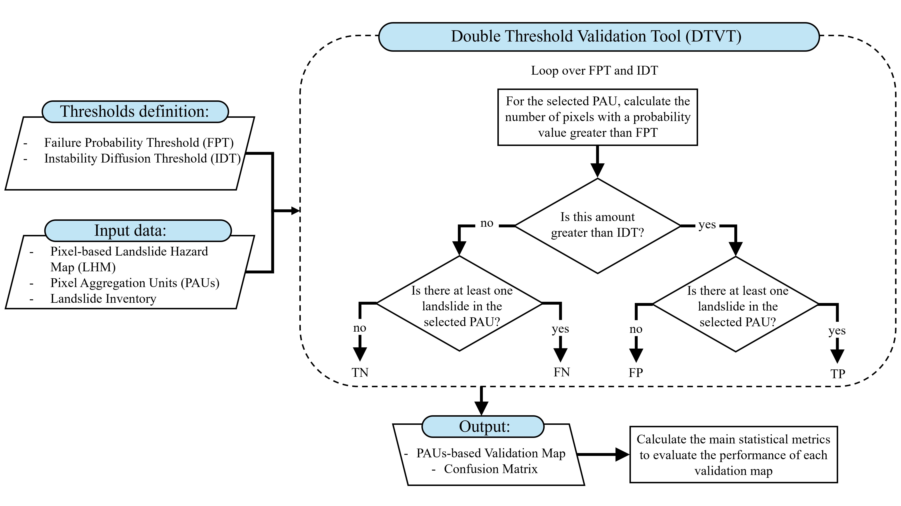

# Double-Threshold Validation Tool (DTVT)

### Code Author: Nicola Nocentini
### Contacts: nicola.nocentini@unifi.it, nicola.nocentini@gmail.com
===========================================================================

This repository contains the code implementation of the **Double-Threshold Validation Tool (DTVT)**, an automatic tool designed to validate pixel-based *Landslide Hazard Maps (LHMs)* and convert them into operational *Landslide Early Warning Systems (LEWSs)*.
DTVT is based on a pair of thresholds used to classify a spatial unit (or *Pixel Aggregation Units (PAUs)*, e.g., a catchment) as stable or unstable:
##### -	*Failure Probability Threshold (FPT)*: the landslide probability value above which a pixel is considered unstable (e.g., ≥ 65%);
##### -	*Instability Diffusion Threshold (IDT)*: the proportion or number of unstable pixels required to classify a selected PAU as unstable and to justify issuing a warning (e.g., at least 5 pixels or 5% of the total pixels within the PAU).
This approach also allows for designing a LEWS structured on multiple warning levels based on different FPT-IDT pairs. By integrating DTVT into landslide hazard assessment workflows, decision-makers can effectively leverage LHMs for disaster risk reduction and emergency response.

You are encouraged to use this code with your own data. If you have any questions or need assistance, please don’t hesitate to contact me.

**DTVT workflow:**

    

